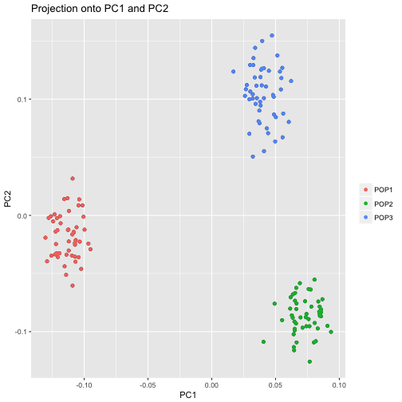
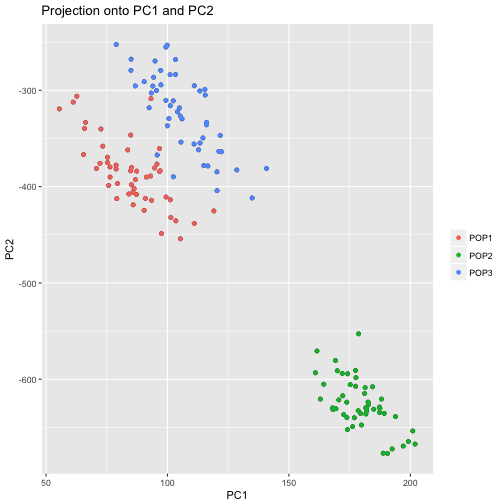

## Introduction {#section #img}

Example


## Introduction

Example


## Introduction


```r
library(pcadapt)
```


## Method


```
## Number of SNPs: 1500
## Number of individuals: 150
```



## Method


```r
plot(y, option = "scores", pop = pop)
```



## Simulations


## Results

