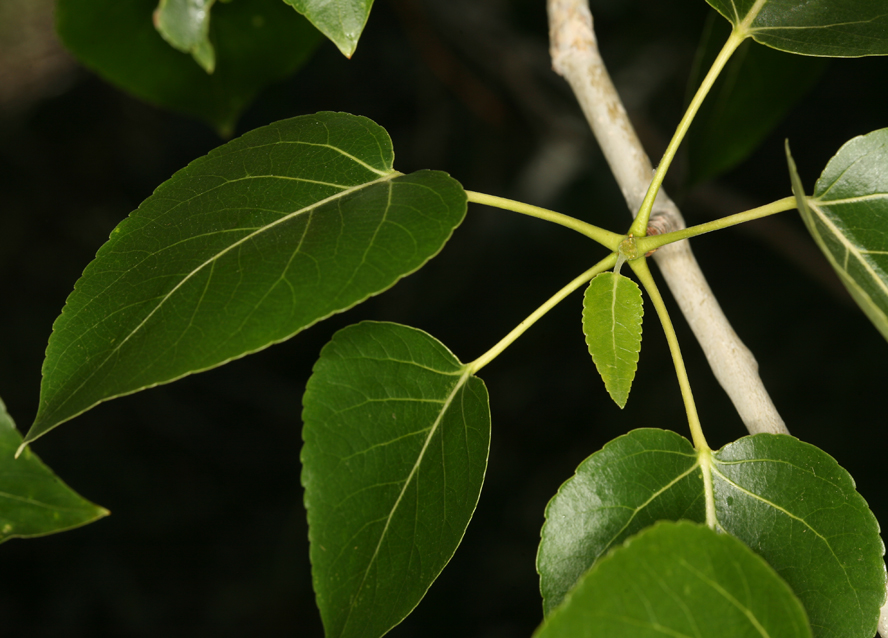
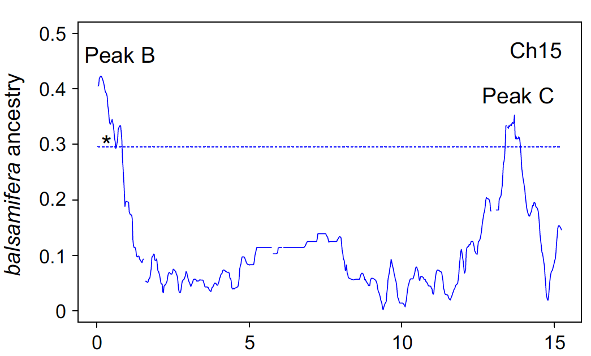
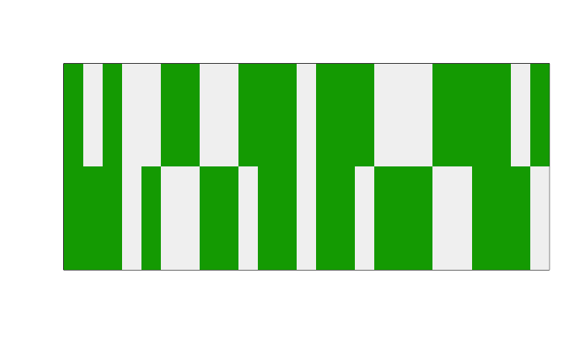

# A PCA-Based Method to detect Introgression
Keurcien Luu, Michael Blum  
March 22, 2017  


---
## Introduction

### **Example**

Populus Balsamifera        |  Populus Trichocarpa
:-------------------------:|:-------------------------:
  |  
Alaska - Newfoundland      | California - Southern Alaska
Low level of precipitations| Moist
High frost tolerance       | Mild conditions
---
## Introduction

### **Example**

<div class="centered">
  <p>Populus hybrid species</p>
   
  <p> 
  - Faster growth rates<br>
  - Cold/Drought tolerance<br>
  
</div>
---
## Introduction

### **Pipeline**

- SNPs with missing data in the parental genotypes were removed using PLINK 1.07

- Parental genotypes were phased with fastphase and FCGENE

- Model selection: time since admixture, recombination rate

- SNPs ancestries with probabilities higher than 95 percent were considered

- Compute the proportions of both ancestries for each remaining SNP

- Average these proportions using sliding windows along each chromosome
---
## Introduction

<div class="columns-2">
  <div>
  <p> Chromosome 6 <br>
  </p>
   
  </div>
  
  <div>
  <p> Chromosome 15 <br>
  </p>
   
  </div>
</div>
---
## Method

*"Indeed, many species show chromosome-scale variation in diversity and 
divergence; species phylogenies can differ along the
genome due to incomplete lineage sorting, adaptive introgression and/or local 
adaptation." (Li, 2016)*
---
## Method

### **Step 1: Normalization**

Let $G$ denote the genotype matrix, and $\tilde{G}$ the normalized genotype matrix
such that for SNP $i$ and individual $j$:

$$\tilde{G}_{ij} = \frac{G_{ij} - f_i}{\sqrt{2 f_i (1 - f_i)}}$$
where $f_i$ represents the minor allele frequency of SNP $i$.

### **Step 2: PCA**

$$\tilde{G} = U \Sigma V^T$$
---
## Method

### **Step 3: "Local PCA"**

Definition: we call *window for SNP* $i$, and denote it by $W_i$, any set of SNPs containing 
SNP $i$.

For instance:

- the 100 SNPs following SNP $i$ in the genotype matrix

- the SNPs that are close to SNP $i$ in terms of genetic distance

## Method
---
### **Step 3: "Local PCA"**

For SNP $i$, compute the contribution $u_i$ of the $i$-th window $W_i$ to the score matrix $U$:

$$u_i = \tilde{G}_{W_i} V_{W_i} \Sigma^{-1}$$

Up to a constant, $u_i$ can be seen as a PCA performed on a genotype matrix 
composed of the SNPs present in $W_i$.
---
## Method


```
## Number of SNPs: 1500
## Number of individuals: 150
```

<!-- -->


---
## Method


```r
plot(y, option = "scores", pop = pop)
```

<!-- -->
---
## Method


```r
plot(x_local, option = "scores", pop = pop)
```

<!-- -->
---
## Simulations

### **Step 1: Ancestral Haplotypes**

**Beagle:** phase the ancestral haplotypes using the three populations (including the 
hybrid species)

- Ancestral population 1: Populus Trichocarpa

- Ancestral population 2: Populus Balsamifera

- Admixed population: Populus Trichocarpa Hybrid
---
## Simulations

### **Step 2: Recombination map**
**vcfR:** extract the physical positions (bp) and convert them into genetic positions (M)
using the mean recombination rate.


```
##   PHY        GEN
## 1 410 0.00002050
## 2 411 0.00002055
## 3 416 0.00002080
## 4 450 0.00002250
## 5 452 0.00002260
## 6 453 0.00002265
## 7 480 0.00002400
## 8 488 0.00002440
```
---
## Simulations

### **Step 3: Generate a hybrid individual**

- Generate the haplotype clusters based on the recombination map

<!-- -->

---
## Results


