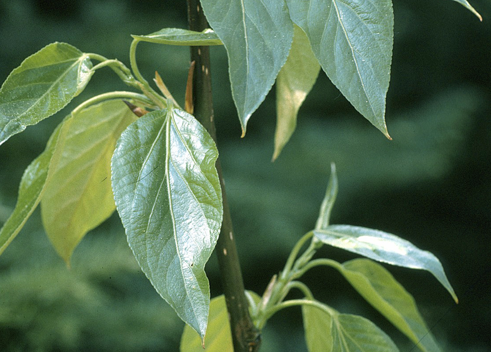
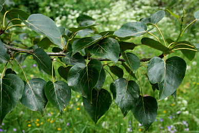
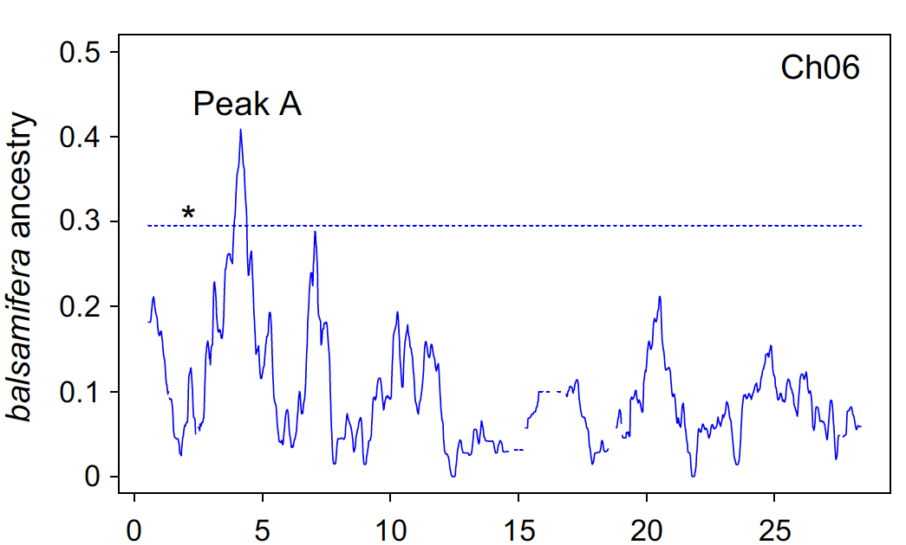

```{r setup, include=FALSE}
knitr::opts_chunk$set(echo = TRUE)
knitr::opts_chunk$set(fig.pos = 'H')

```

## Introduction

### **Example**

Populus Balsamifera        |  Populus Trichocarpa
:-------------------------:|:-------------------------:
  |  
Alaska - Newfoundland      | California - Southern Alaska
Low level of precipitations| Moist
High frost tolerance       | Mild conditions

## Introduction

### **Example**

<div class="centered">
  <p>Populus hybrid species</p>
   
  <p> 
  - Faster growth rates<br>
  - Cold/Drought tolerance<br>
  
</div>

## Introduction

### **Pipeline**

- SNPs with missing data in the parental genotypes were removed using PLINK 1.07

- Parental genotypes were phased with fastphase and FCGENE

- Model selection: time since admixture, recombination rate

- SNPs ancestries with probabilities higher than 95 percent were considered

- Compute the proportions of both ancestries for each remaining SNP

- Average these proportions using sliding windows along each chromosome

## Introduction

<div class="columns-2">
  <div>
  <p> Chromosome 6 <br>
  </p>
   
  </div>
  
  <div>
  <p> Chromosome 15 <br>
  </p>
   
  </div>
</div>

## Method

*"Indeed, many species show chromosome-scale variation in diversity and 
divergence; species phylogenies can differ along the
genome due to incomplete lineage sorting, adaptive introgression and/or local 
adaptation." (Li, 2016)*

## Method

### **Step 1: Normalization**

Let $G$ denote the genotype matrix, and $\tilde{G}$ the normalized genotype matrix
such that for SNP $i$ and individual $j$:

$$\tilde{G}_{ij} = \frac{G_{ij} - f_i}{\sqrt{2 f_i (1 - f_i)}}$$
where $f_i$ represents the minor allele frequency of SNP $i$.

### **Step 2: PCA**

$$\tilde{G} = U \Sigma V^T$$

## Method

### **Step 3: "Local PCA"**

Definition: we call *window for SNP* $i$, and denote it by $W_i$, any set of SNPs containing 
SNP $i$.

For instance:

- the 100 SNPs following SNP $i$ in the genotype matrix

- the SNPs that are close to SNP $i$ in terms of genetic distance

## Method

### **Step 3: "Local PCA"**

For SNP $i$, compute the contribution $u_i$ of the $i$-th window $W_i$ to the score matrix $U$:

$$u_i = \tilde{G}_{W_i} V_{W_i} \Sigma^{-1}$$

Up to a constant, $u_i$ can be seen as a PCA performed on a genotype matrix 
composed of the SNPs present in $W_i$.

## Method

```{r, echo=FALSE}
library(pcadapt)
geno <- as.matrix(read.table(read.pcadapt("geno3pops", type = "example")))
begin <- 500
end <- 700
x <- pcadapt(geno, K = 2)
y <- NULL
geno_s <- scale_geno(geno, ploidy = 2, maf = x$maf, keep_or_not = 1*(x$maf >= 0.05))
y$scores <- cmpt_local_pca(t(geno_s), V = x$loadings, sigma = as.vector(x$singular.values), beg = begin, end = end)
class(y) <- "pcadapt"
attr(y, "method") <- "mahalanobis"
attr(y, "data.type") <- "genotype"
attr(y, "K") <- 2
pop <- c(rep("POP1", 50), rep("POP2", 50), rep("POP3", 50))
plot(x, option = "scores", pop = pop)
```


## Method

```{r}
plot(y, option = "scores", pop = pop)
```

## Method

```{r, include=FALSE,echo=FALSE}
geno_local <- geno[begin:end, ]
x_local <- pcadapt(geno_local, K = 2)
```

```{r}
plot(x_local, option = "scores", pop = pop)
```

## Simulations

### **Step 1: Ancestral Haplotypes**

**Beagle:** phase the ancestral haplotypes using the three populations (including the 
hybrid species)

- Ancestral population 1: Populus Trichocarpa

- Ancestral population 2: Populus Balsamifera

- Admixed population: Populus Trichocarpa Hybrid

## Simulations

### **Step 2: Recombination map**
**vcfR:** extract the physical positions (bp) and convert them into genetic positions (M)
using the mean recombination rate.

```{r, echo=FALSE, fig.align="center"}
pos <- c(410, 411, 416, 450, 452, 453, 480, 488); recombination.rate <- 5e-8 
rates <- data.frame(PHY = pos, GEN = format(pos * recombination.rate, 
                                 scientific = FALSE, nsmall = 8))
print(rates)
```

## Simulations

### **Step 3: Generate a hybrid individual**

- Generate the haplotype clusters based on the recombination map

```{r, echo=FALSE}
library(lattice)
hap <- matrix(sample(c(0, 1), size = 50, replace = TRUE), ncol = 2)
image(hap, col = terrain.colors(2), xaxt = "n", yaxt = "n")
```


## Results


